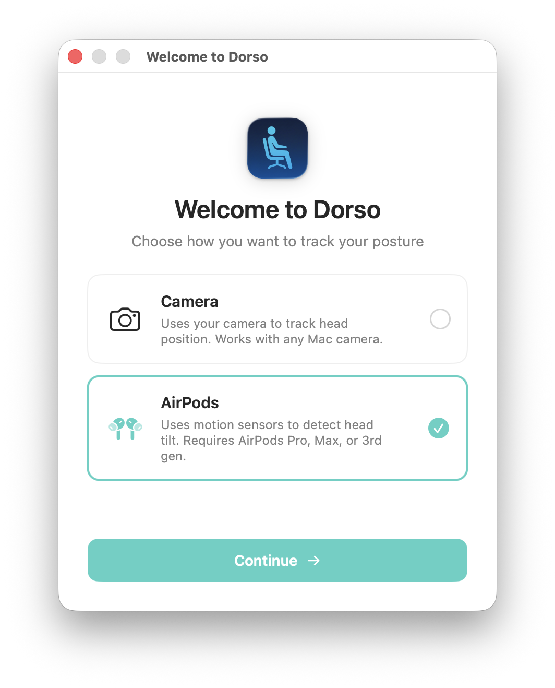
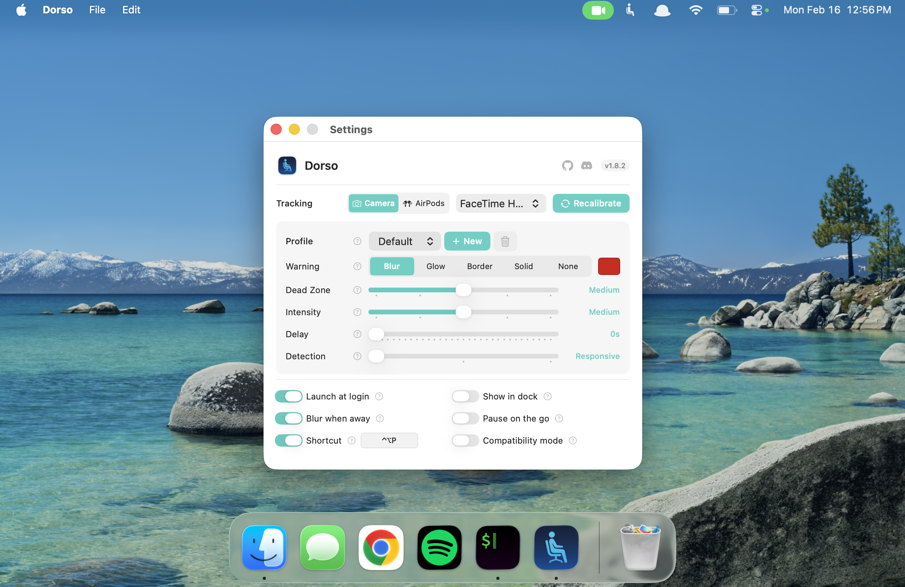
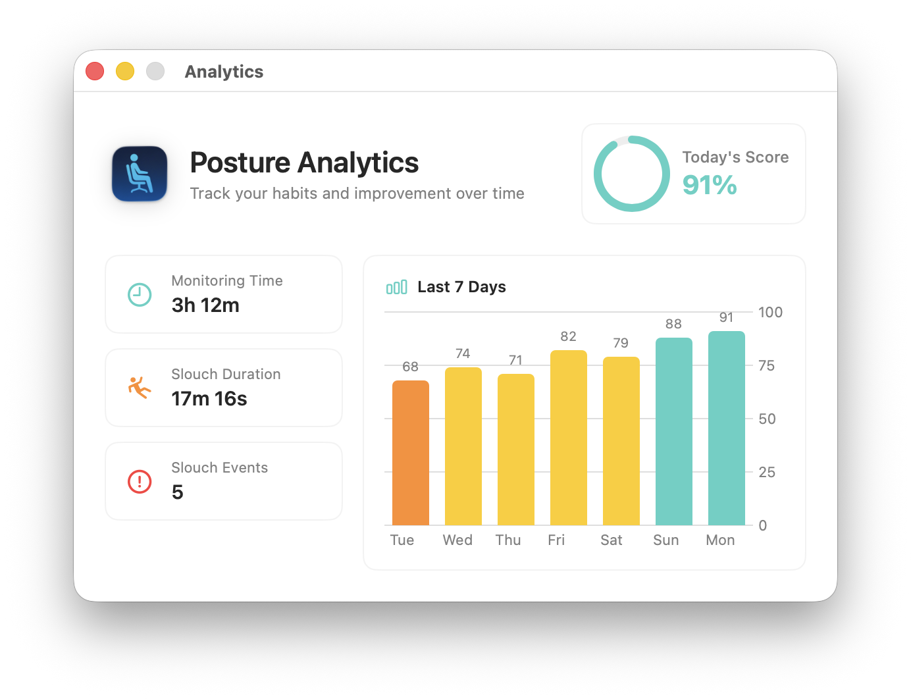

# Dorso (<a href="https://tomjohnell.com/i-made-a-mistake-posturr-is-now-dorso/" target="_blank">formerly Posturr</a>)

**A macOS app that blurs your screen when you slouch.**

Dorso monitors your posture in real-time using either your Mac's camera or AirPods motion sensors. When it detects that you're slouching, it progressively blurs your screen to remind you to sit up straight. Maintain good posture, and the blur clears instantly.

[](https://apps.apple.com/us/app/posturr-posture-monitor/id6758276540?mt=12)

[](https://github.com/tldev/dorso/releases/latest)
[](https://discord.gg/6Ufy2SnXDW)

**Join our Discord** to share feedback, get help, suggest features, and connect with other Dorso users!

<p align="center">
  <video src="https://github.com/user-attachments/assets/de02c78b-c6c4-4ddc-9650-320e7267921a" width="640" autoplay loop muted playsinline>
    Dorso demo: slouching triggers screen blur, good posture keeps it clear
  </video>
</p>

## Screenshots

<p align="center">
  
  
</p>

<p align="center">
  
  
</p>

## Features

- **Two tracking methods** - Use your camera (Vision framework) or AirPods motion sensors
- **AirPods motion tracking** - Track posture without camera using AirPods Pro, Max, or 3rd gen+ (macOS 14+)
- **Progressive screen blur** - Gentle visual reminder that intensifies with worse posture
- **Menu bar controls** - Easy access to settings, calibration, and status from the menu bar
- **Multi-display support** - Works across all connected monitors
- **Privacy-focused** - All processing happens locally on your Mac
- **Lightweight** - Runs as a background app with minimal resource usage
- **Optional Dock visibility** - Show in Dock and Cmd+Tab app switcher when preferred
- **No account required** - No signup, no cloud, no tracking

## Installation

### Homebrew (Recommended)

```bash
brew install dorso
```

### Manual Download

1. Download the latest `Dorso-vX.X.X.dmg` or `.zip` from the [Releases](../../releases) page
2. Open the DMG and drag `Dorso.app` to your Applications folder
3. Launch normally - no Gatekeeper warnings (app is signed and notarized)

### Permissions

**Camera Mode:** Requires camera access. When you first launch the app, macOS will ask for permission.

**AirPods Mode:** Requires Motion & Fitness Activity permission (macOS 14+). This allows the app to read head motion data from your AirPods.

If you accidentally denied permission, you can grant it later in **System Settings** > **Privacy & Security** > **Camera** or **Motion & Fitness Activity**.

## Usage

Once launched, Dorso appears in your menu bar with a person icon. The app continuously monitors your posture and applies screen blur when slouching is detected.

### Menu Bar Controls

Click the menu bar icon to access:

- **Status** - Shows current state (Monitoring, Slouching, Good Posture, etc.)
- **Enabled** - Toggle posture monitoring on/off
- **Recalibrate** - Reset your baseline posture (sit up straight, then click)
- **Settings** - Open the settings window to configure all options
- **Quit** - Exit the application

### Settings Window

The Settings window (accessible from the menu bar) provides:

- **Sensitivity** - Adjust how sensitive the slouch detection is (5 levels from Low to Very High)
- **Dead Zone** - Set the tolerance before blur kicks in (5 levels from None to Very Large)
- **Blur when away** - Blur screen when you step away from camera
- **Show in dock** - Show app in Dock and Cmd+Tab app switcher
- **Pause on the go** - Auto-pause when laptop display becomes the only screen
- **Compatibility mode** - Use public macOS APIs for blur (try this if blur doesn't appear)

### Tips for Best Results

- Position your camera at eye level when possible
- Ensure adequate lighting on your face
- Sit at a consistent distance from your screen
- The app works best when your shoulders are visible

## How It Works

Dorso offers two tracking methods:

### Camera Mode
Uses Apple's Vision framework to detect body pose landmarks:
- **Body Pose Detection**: Tracks nose and head position
- **Face Detection Fallback**: When full body isn't visible, tracks face position
- **Posture Analysis**: Measures vertical head position against your calibrated baseline

### AirPods Mode
Uses motion sensors in compatible AirPods (Pro, Max, 3rd gen+):
- **Head Tilt Detection**: Tracks pitch angle of your head
- **No Camera Required**: Works without any camera access
- **Automatic Pause**: Pauses when AirPods are removed from ears

The screen blur uses macOS's private CoreGraphics API by default for efficient, system-level blur. If the blur doesn't appear on your system, enable **Compatibility Mode** from settings to use `NSVisualEffectView` instead.

## Building from Source

### Requirements

- macOS 13.0 (Ventura) or later
- Xcode Command Line Tools (`xcode-select --install`)

### Build

```bash
git clone https://github.com/tldev/dorso.git
cd dorso
./build.sh
```

The built app will be in `build/Dorso.app`.

### Build Options

```bash
# Standard build
./build.sh

# Build with release archive (.zip)
./build.sh --release
```

### Manual Build

```bash
swiftc -O \
    -framework AppKit \
    -framework AVFoundation \
    -framework Vision \
    -framework CoreImage \
    -o Dorso \
    Sources/*.swift
```

## Known Limitations

- **Camera mode**: Requires a working camera with adequate lighting and clear view of upper body/face
- **AirPods mode**: Requires macOS 14.0+ and compatible AirPods (Pro, Max, or 3rd generation+)

## Command Interface

Dorso exposes a file-based command interface for external control:

| Command | Description |
|---------|-------------|
| `capture` | Take a photo and analyze pose |
| `blur <0-64>` | Set blur level manually |
| `quit` | Exit the application |

Write commands to `/tmp/dorso-command`. Responses appear in `/tmp/dorso-response`.

## System Requirements

- macOS 13.0 (Ventura) or later
- Camera (built-in or external)
- Approximately 10MB disk space

## Privacy

Dorso processes all video data locally on your Mac. No images or data are ever sent to external servers. The camera feed is used solely for posture detection and is never stored or transmitted.

## License

MIT License - see [LICENSE](LICENSE) for details.

## Project Structure

```
dorso/
├── Sources/
│   ├── main.swift                  # App entry point
│   ├── AppDelegate.swift           # Main app coordinator and state machine
│   ├── PostureDetector.swift       # Protocol for posture detection methods
│   ├── CameraPostureDetector.swift # Camera-based detection (Vision framework)
│   ├── AirPodsPostureDetector.swift # AirPods motion-based detection
│   ├── Models.swift                # Shared types (settings keys, profile data, app state)
│   ├── Persistence.swift           # Settings and profile storage
│   ├── DisplayManager.swift        # Display detection and configuration
│   ├── MenuBar.swift               # Menu bar setup and management
│   ├── SettingsWindow.swift        # SwiftUI settings window
│   ├── OnboardingWindow.swift      # Tracking method selection UI
│   ├── CalibrationWindow.swift     # Calibration UI
│   └── BlurOverlay.swift           # Screen blur overlay management
├── build.sh                        # Build script
├── release.sh                      # Release automation
└── AppIcon.icns                    # App icon
```

## Contributing

Contributions are welcome! Please feel free to submit issues and pull requests.

## Acknowledgments

- Built with Apple's Vision framework for body pose detection
- Uses private CoreGraphics API for blur, with NSVisualEffectView fallback
- Inspired by the need for better posture during long coding sessions

## Linux version

Want this on Linux? See [postured](https://github.com/vadi2/postured).

### Contributors

- [@kimik-hyum](https://github.com/kimik-hyum) - AirPods motion tracking, forward-head posture detection
- [@wklm](https://github.com/wklm) - Compatibility mode implementation
- [@cam-br0wn](https://github.com/cam-br0wn) - Dock/App Switcher visibility toggle
- [@einsteinx2](https://github.com/einsteinx2) - SwiftPM/Xcode support
- [@ssisk](https://github.com/ssisk) - Screen lock pause feature suggestion
- [@gcanyon](https://github.com/gcanyon) - Warning onset delay feature suggestion
- [@javabudd](https://github.com/javabudd) - Analytics dashboard
- [@danielroek](https://github.com/danielroek) - "None" warning style option
- [@claaslange](https://github.com/claaslange) - Camera compatibility issue with professional cameras
- [@lucapericlp](https://github.com/lucapericlp) - Settings profiles feature
- [@DengNaichen](https://github.com/DengNaichen) - Sleep/wake camera detection fix
